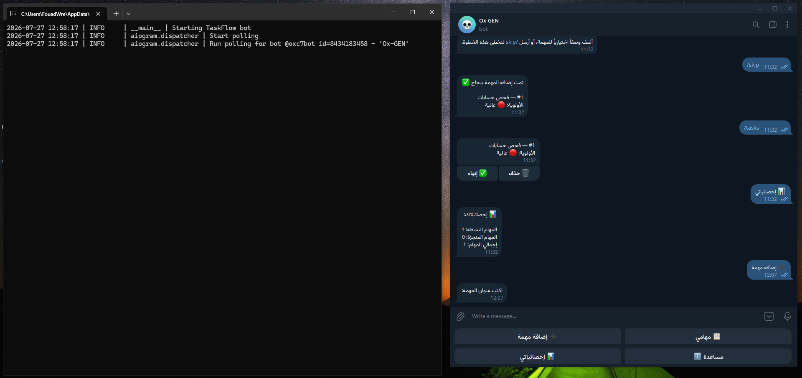

# TaskFlow Bot 🤖

A Telegram bot for personal task management, built on a scalable asynchronous architecture with admin-level permissions, persistent storage via SQLAlchemy, and centralized error handling.

## ✨ Features

- Add, list, complete, and delete tasks through an interactive conversation flow (FSM).
- Set a priority level for each task (low / medium / high).
- Inline and reply keyboards for a smooth user experience.
- Admin permission system: global statistics and broadcast messaging, with a preview-and-confirm step before sending.
- Persistent storage via SQLAlchemy (SQLite by default, easily swappable to PostgreSQL/MySQL by changing the connection URL).
- Custom middleware for:
  - Per-user rate limiting.
  - Automatic database injection and new-user registration.
- Centralized error handling with logging to both file and console.
- Flexible configuration through environment variables (`.env`).

## 🛠️ Tech Stack

| Technology | Purpose |
|---|---|
| Python 3.12 | Core language |
| aiogram 3 | Asynchronous Telegram bot framework |
| SQLAlchemy 2.0 (Async) | ORM for database access |
| SQLite / aiosqlite | Default lightweight database |
| python-dotenv | Environment variable management |

## 📁 Project Structure

```
telegram-taskflow-bot/
├── bot/
│   ├── config.py            # Loads settings from .env
│   ├── models.py             # SQLAlchemy models
│   ├── database.py           # Data access layer
│   ├── keyboards.py          # Keyboard layouts
│   ├── states.py             # FSM states
│   ├── logging_config.py     # Logging setup
│   ├── handlers/
│   │   ├── start.py          # Start and help commands
│   │   ├── tasks.py          # Task management
│   │   ├── admin.py          # Admin control panel
│   │   └── errors.py         # Error handling
│   └── middlewares/
│       ├── db.py              # Database injection
│       └── throttling.py      # Rate limiting
├── main.py
├── requirements.txt
├── .env.example
└── .gitignore
```

## 🚀 Installation & Setup

```bash
git clone https://github.com/FouadWre-Dev/taskflow-telegram-bot.git
cd telegram-taskflow-bot

python -m venv venv
source venv/bin/activate      # on Windows: venv\Scripts\activate

pip install -r requirements.txt

cp .env.example .env
# set BOT_TOKEN and ADMIN_IDS inside .env

python main.py
```

You can get a `BOT_TOKEN` from [@BotFather](https://t.me/BotFather) on Telegram.

## 📸 Screenshots



## 💼 Value for Employers

This project demonstrates the ability to:
- Correctly build asynchronous (async/await) applications in a production-like setting.
- Design a clear, layered architecture (Handlers / Database / Middlewares / Config) that's easy to extend and maintain.
- Work with a modern async ORM (SQLAlchemy 2.0) instead of raw SQL queries.
- Apply Middleware and FSM patterns for conversation state management — skills that transfer directly to any other backend framework (FastAPI, Django, etc.).
- Handle errors and rate limits the way real-world systems are built, not just as a toy demo.

## 📄 License

MIT License